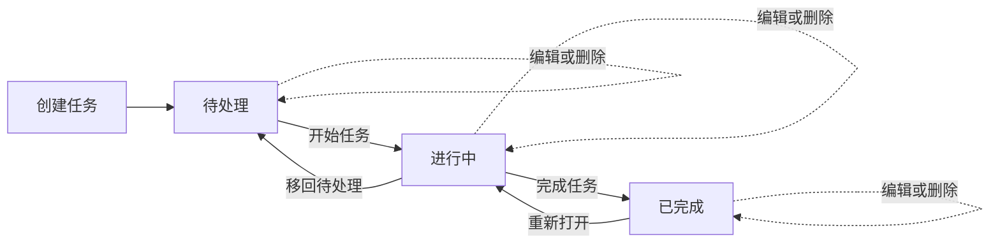

# 个人 Sprint 任务板 — 产品需求文档

| 文档属性 | 内容 |
|---|---|
| 产品名称 | 个人 Sprint 任务板 |
| 展示品牌 | Sprint Flow |
| 文档类型 | 产品需求文档（PRD） |
| 版本 | 1.1 |
| 状态 | 待评审 |
| 最后更新 | 2026-08-15 |
| 目标版本 | MVP 演示版本 |
| 产品范围 | 已登录用户端 Web 应用及 Client API |
| 产品语言 | 简体中文 |

## 1. 文档摘要

个人 Sprint 任务板是一款轻量的个人任务管理产品。用户可以创建任务、开始处理、完成任务，并立即在任务看板和统计数据中看到进度变化。

产品规模经过刻意控制，适合作为 Sprint Flow 开发流程的完整演示项目，同时能够覆盖需求评审、页面设计、数据库迁移、后端业务规则、API 开发、前端开发、接口联调、自动化测试、验收和成果展示。

本次 MVP 只包含用户端功能，不建设管理后台，不提供管理员角色，也不开发 Backoffice API。所有任务均归属于当前登录用户，并通过 Client API 访问。

## 2. 项目背景

当前基础框架已经具备用户认证、路由守卫、仪表盘布局、深色主题、React 前端和 FastAPI 后端，但尚未形成一个可以完整演示的用户业务闭环。

本次需要建设一个具备以下特征的展示项目：

- 观众可以在短时间内理解产品用途；
- 用户操作前后的页面变化直观、可见；
- 能够完整展示前端、后端、数据库和测试工作；
- 业务范围适合在一个演示 Sprint 内完成；
- 最终成果可以通过实际操作和自动化测试共同证明。

## 3. 产品定位

### 3.1 产品愿景

帮助个人用户将待办事项转化为清晰、可见、可衡量的完成进度。

### 3.2 核心价值

> 创建重要任务，专注当前工作，让每一次完成都清晰可见。

### 3.3 体验原则

1. **进度清晰可见**：每次状态变化都立即反映到看板和统计数据中。
2. **下一步操作明确**：每张任务卡只突出当前状态下最重要的操作。
3. **界面保持专注**：MVP 不引入项目配置、团队协作等复杂概念。
4. **操作反馈及时**：加载、成功、校验失败和接口失败都有明确反馈。
5. **业务规则一致**：前端展示规则与后端服务层校验保持一致。
6. **中文表达统一**：页面文案、校验提示、业务错误和测试数据统一使用简体中文。

## 4. 产品目标与成功标准

### 4.1 产品目标

- 让登录用户完成个人任务的完整生命周期管理。
- 提供具备展示效果的任务看板，清晰表达任务状态和优先级。
- 提供随任务状态实时变化的个人任务统计。
- 展示可靠的接口校验、任务归属控制和错误处理能力。
- 为核心业务闭环提供后端与前端自动化测试。

### 4.2 演示成功标准

演示者能够在不修改数据库、不手动刷新页面的情况下完成以下操作：

1. 使用现有用户认证功能登录系统。
2. 创建一条有效任务。
3. 在“待处理”分组中看到新任务。
4. 开始任务，并看到任务移动到“进行中”。
5. 编辑任务内容。
6. 完成任务，并看到任务移动到“已完成”。
7. 查看完成时间和更新后的完成率。
8. 重新打开任务，并看到完成时间和统计数据正确变化。

### 4.3 质量目标

- 所有关键验收场景通过。
- 不存在未解决的严重或高优先级缺陷。
- 所有核心接口请求都有可见的加载和错误反馈。
- 主要演示流程在 1280 px 及以上桌面宽度正常使用。
- 系统在 390 px 移动端视口下保持可用。
- 不同用户之间的任务数据严格隔离。

## 5. 项目范围

### 5.1 MVP 包含范围

- 复用现有用户登录和路由保护能力
- 创建个人任务
- 查看个人任务列表和状态看板
- 搜索和筛选任务
- 查看任务详情
- 编辑任务信息
- 按规则流转任务状态
- 确认后删除任务
- 查看个人任务统计
- 桌面端和移动端响应式展示
- 加载、空数据、校验失败、接口错误和成功反馈
- 核心后端及前端自动化测试

### 5.2 明确排除范围

- 管理后台、管理员页面和 Backoffice API
- 团队空间、任务分配和任务共享
- 多角色任务管理
- 评论、附件和操作动态
- 拖拽式状态流转
- 重复任务和任务提醒
- 邮件、推送和站内通知
- 多看板、项目或 Sprint 配置
- 工时记录和工作量估算
- 日历及第三方系统集成
- 高级报表和历史趋势图
- 离线编辑

## 6. 用户与使用场景

### 6.1 目标用户

**个人任务执行者**

- 需要管理少量个人任务；
- 希望快速区分待处理、正在处理和已经完成的工作；
- 希望在几秒内完成任务创建和状态更新；
- 演示时主要使用桌面浏览器，同时保留移动端可用性。

### 6.2 用户权限规则

- 使用现有用户端登录流程完成身份认证。
- 所有任务接口都必须验证当前登录用户。
- 每条任务只归属于一个用户。
- 用户只能查询、查看、编辑、流转和删除自己的任务。
- 访问其他用户的任务时统一返回 `404 Not Found`，不暴露资源是否存在。

## 7. 核心业务闭环



### 7.1 核心成功路径

1. 用户进入“我的 Sprint”页面。
2. 系统加载个人任务统计和任务列表。
3. 用户点击“新建任务”。
4. 用户填写标题、可选描述、优先级和可选截止日期。
5. 系统以 `todo` 状态创建任务。
6. 新任务出现在“待处理”分组，总任务数同步增加。
7. 用户点击“开始任务”。
8. 任务移动到“进行中”分组。
9. 用户点击“完成任务”。
10. 任务移动到“已完成”分组，系统记录完成时间并刷新统计。

## 8. 信息架构

| 路由 | 页面 | 用途 | 访问权限 |
|---|---|---|---|
| `/login` | 现有登录页 | 完成用户身份认证 | 公开 |
| `/dashboard` | 我的 Sprint | 查看统计、筛选任务并执行任务生命周期操作 | 已登录用户 |
| `/tasks/:task_id` | 任务详情 | 查看和管理单条任务 | 任务所有者 |

继续使用现有受保护的 Layout 作为应用外壳。侧边导航只保留一个产品入口“我的 Sprint”，确保 MVP 信息架构简单明确。

## 9. 页面视觉与交互设计

### 9.1 设计方向

整体设计主题定义为 **专注推进（Focused Momentum）**：使用深色生产力工作台、克制的层级表面、高对比度信息和紫色到洋红色的渐变主操作色。

设计延续现有基础框架中的深色主题和 Ant Design 组件体系，避免引入不一致的视觉语言。

产品应呈现以下感受：

- 专注、清晰，装饰元素适量；
- 现代并具有推进感，动画保持克制；
- 信息密度适合任务管理，同时保留舒适间距；
- 通过颜色、文字和位置变化明确表达任务状态。

### 9.2 设计系统基础

#### 颜色规范

| 语义角色 | Token / 色值 | 使用场景 |
|---|---|---|
| 应用背景 | `--gray-900` / `#181a1e` | 页面主画布 |
| 导航与卡片 | `--gray-800` / `#1e1f24` | 侧边栏、任务卡、弹窗 |
| 浮层表面 | `--gray-700` / `#292c3a` | 悬停状态、菜单、浮层 |
| 主要文字 | `rgba(255, 255, 255, 0.87)` | 标题、关键数字和正文 |
| 次要文字 | `rgba(255, 255, 255, 0.60)` | 辅助说明和元数据 |
| 边框 | `rgba(255, 255, 255, 0.10)` | 表面分隔 |
| 主要操作 | 紫色到洋红色渐变 | 新建和确认操作 |
| 待处理状态 | `#a5a8b4` | 中性状态标识 |
| 进行中状态 | `#5380fb` | 活跃任务标识 |
| 已完成状态 | `#32d470` | 完成状态标识 |
| 警告/逾期 | `#ffae2b` | 截止日期提醒 |
| 删除/高优先级 | `#ea3d43` | 危险操作和高优先级 |

颜色不能作为唯一的信息表达方式。所有状态和优先级必须同时显示中文文字或图标。

#### 字体规范

- 字体：`Inter`、系统无衬线字体；中文优先使用系统中文字体。
- 页面标题：30–32 px，字重 600。
- 区块标题：18–20 px，字重 600。
- 卡片标题：15–16 px，字重 600。
- 正文：14 px，字重 400。
- 辅助信息：12–13 px，字重 400–500。
- 统计数字：28–32 px，字重 600，支持时使用等宽数字。

#### 圆角、间距与层级

- 基础间距单位：4 px。
- 页面间距：桌面端 24 px，移动端 16 px。
- 卡片内边距：16 px。
- 主要表面圆角：12 px。
- 紧凑控件圆角：8 px。
- 边框：1 px 低对比度边框。
- 阴影：仅在可交互或浮层表面使用轻微环境阴影。
- 常规过渡：200 ms ease，用于悬停和状态移动。

#### 图标规范

- 产品图标统一使用现有 `SvgIcon` 组件。
- 主要生命周期操作必须同时包含文字，不能只显示图标。
- 建议图标：看板、新建、搜索、筛选、日历、编辑、删除、开始、完成、重新打开和返回。

### 9.3 应用外壳

#### 桌面端

- 左侧固定 240 px 侧边栏。
- 顶部品牌区域展示 Sprint Flow 标识和名称。
- 导航仅包含选中状态的“我的 Sprint”。
- 主内容区最大可读宽度为 1440 px，页面内边距为 24 px。
- 侧边栏保持低视觉权重，让任务看板成为页面主体。

#### 移动端

- 固定侧边栏替换为紧凑顶部栏和导航抽屉。
- 页面内边距缩小为 16 px。
- 核心操作在不产生整页横向滚动的情况下保持可见。

### 9.4 “我的 Sprint”页面

```text
┌───────────────┬──────────────────────────────────────────────────────────────┐
│ Sprint Flow   │ 我的 Sprint                                  [＋ 新建任务] │
│               │ 让每项工作从计划稳步走向完成。                              │
│ ● 我的 Sprint ├──────────────────────────────────────────────────────────────┤
│               │ [总数 12] [待处理 5] [进行中 3] [已完成 4] [完成率 33%]   │
│               ├──────────────────────────────────────────────────────────────┤
│               │ [ 搜索任务… ] [优先级 ▾] [截止日期 ▾] [重置]             │
│               ├──────────────────┬──────────────────┬───────────────────────┤
│               │ 待处理 · 5       │ 进行中 · 3       │ 已完成 · 4            │
│               │ ┌──────────────┐ │ ┌──────────────┐ │ ┌───────────────────┐ │
│               │ │ 高优先级     │ │ │ 中优先级     │ │ │ 低优先级       ✓ │ │
│               │ │ 任务标题     │ │ │ 任务标题     │ │ │ 任务标题          │ │
│               │ │ 8月18日截止  │ │ │ 今天截止     │ │ │ 8月15日完成       │ │
│               │ │ [开始] [••]  │ │ │ [完成] [••]  │ │ │ [重新打开] [••]  │ │
│               │ └──────────────┘ │ └──────────────┘ │ └───────────────────┘ │
└───────────────┴──────────────────┴──────────────────┴───────────────────────┘
```

#### 页面信息层级

1. 页面标题、说明文案和“新建任务”主操作。
2. 五个紧凑型统计卡片。
3. 搜索和筛选工具栏。
4. 带数量的三个任务状态分组。
5. 带生命周期操作的任务卡片。

#### 统计卡片

页面显示以下统计：

- 任务总数
- 待处理
- 进行中
- 已完成
- 完成率

完成率计算方式为 `已完成数量 / 任务总数 × 100`，四舍五入为整数。任务总数为零时，完成率显示为 `0%`。

#### 看板响应式行为

- 宽度大于或等于 1200 px 时显示三列等宽看板。
- 平板宽度保留三列最小宽度，并允许看板区域横向滚动。
- 移动端使用“待处理 / 进行中 / 已完成”状态标签页，每次显示一个任务分组。
- 任务默认按照 `updated_at` 从新到旧排序。
- 生命周期操作成功后，任务以约 200 ms 的过渡移动到目标分组。
- MVP 不实现拖拽操作。

### 9.5 任务卡片

每张任务卡显示：

- 优先级标签
- 任务标题，最多显示两行
- 可选描述摘要，最多显示两行
- 可选截止日期
- 逾期状态提示
- 一个主要生命周期操作
- 更多菜单：“查看详情”“编辑”“删除”

不同状态下的主要操作：

| 当前状态 | 主要操作 | 操作结果 |
|---|---|---|
| 待处理 | 开始任务 | 移动到进行中 |
| 进行中 | 完成任务 | 移动到已完成 |
| 已完成 | 重新打开 | 移动到进行中 |

任务卡必须支持键盘聚焦并显示清晰的焦点边框。必要信息不能只在鼠标悬停后出现。

### 9.6 新建/编辑任务弹窗

- 桌面端宽度约 600 px。
- 移动端使用全宽底部面板或全屏弹窗。
- 标题分别为“新建任务”和“编辑任务”。
- 字段顺序：任务标题、任务描述、优先级、截止日期。
- 主要按钮：“创建任务”或“保存修改”。
- 次要按钮：“取消”。
- 提交期间主要按钮显示加载状态并阻止重复提交。
- 表单内容发生变化后直接关闭，需要二次确认是否放弃修改。
- 能映射到字段的后端校验信息显示在字段下方；其他错误使用简洁的中文消息提示。

### 9.7 任务详情页

```text
┌──────────────────────────────────────────────────────────────────────────────┐
│ ← 返回我的 Sprint                                                          │
│                                                                            │
│ 完成 Sprint Flow 演示                           [进行中] [完成任务]        │
│ 高优先级 · 8月18日截止                                                   │
├──────────────────────────────────────────────┬───────────────────────────────┤
│ 任务描述                                     │ 任务信息                      │
│ 完成前后端任务生命周期开发和联调……           │ 状态         进行中           │
│                                              │ 优先级       高               │
│                                              │ 创建时间     8月15日 10:20    │
│                                              │ 更新时间     8月15日 11:04    │
│                                              │ 完成时间     —                │
│                                              │ [编辑] [删除]                 │
└──────────────────────────────────────────────┴───────────────────────────────┘
```

- 页头包含返回操作、标题、状态和当前主要生命周期操作。
- 主内容区域展示完整任务描述。
- 信息面板展示状态、优先级、截止日期、创建时间、更新时间和完成时间。
- 删除操作使用危险样式并弹出确认对话框。
- 移动端将信息面板堆叠在任务描述下方。

### 9.8 必须覆盖的界面状态

| 状态 | 页面要求 |
|---|---|
| 首次加载 | 显示统计和任务卡片骨架屏，不能先展示误导性的零值 |
| 无任务 | 显示积极的空状态图标、“还没有任务”和“创建第一个任务”按钮 |
| 筛选无结果 | 显示“没有符合条件的任务”和“重置筛选”按钮 |
| 首次加载失败 | 显示页面内错误状态和“重试”按钮 |
| 操作失败 | 保持原数据并显示一次中文错误提示 |
| 保存中 | 禁用提交按钮并显示加载图标 |
| 操作成功 | 服务端确认后移动任务，并显示简洁的成功消息 |
| 校验失败 | 保留输入内容，在对应字段下显示中文校验信息 |
| 登录失效 | 复用现有全局会话过期处理并跳转登录页 |
| 任务不存在 | 显示友好的“任务不存在”状态和返回看板入口 |
| 任务逾期 | 显示警告图标和“已逾期”文字，已完成任务不标记逾期 |

### 9.9 可访问性要求

- 正文和交互控件达到 WCAG 2.1 AA 对比度要求。
- 所有操作支持键盘访问，并显示可见焦点状态。
- 弹窗打开后限制焦点范围，关闭后焦点返回触发按钮。
- 输入框必须有长期可见的标签，不能只依赖占位符。
- 纯图标操作必须提供可访问名称。
- 状态和优先级必须同时通过文字表达，不能只依赖颜色。
- 动态成功和失败消息通过现有消息系统使用合适的 live region。
- 用户启用“减少动态效果”时，关闭非必要动画。

## 10. 功能需求

优先级采用 MoSCoW：必须、应该、可以和本期不做。

### 10.1 看板与统计

| 编号 | 需求 | 优先级 |
|---|---|---|
| FR-DB-001 | 系统只能展示当前登录用户拥有的任务。 | 必须 |
| FR-DB-002 | 系统必须将可见任务分为待处理、进行中和已完成三组。 | 必须 |
| FR-DB-003 | 系统必须显示任务总数、各状态数量和完成率。 | 必须 |
| FR-DB-004 | 创建、流转和删除任务后必须刷新统计。 | 必须 |
| FR-DB-005 | 用户可以搜索任务标题和描述。 | 必须 |
| FR-DB-006 | 用户可以按照优先级筛选任务。 | 必须 |
| FR-DB-007 | 用户应该可以按今天截止、即将截止、已逾期和无截止日期筛选。 | 应该 |
| FR-DB-008 | 用户可以通过一次操作清除全部筛选条件。 | 必须 |
| FR-DB-009 | 看板必须提供加载、无任务、筛选无结果和重试状态。 | 必须 |

### 10.2 创建任务

| 编号 | 需求 | 优先级 |
|---|---|---|
| FR-CR-001 | 用户可以从看板打开新建任务弹窗。 | 必须 |
| FR-CR-002 | 任务标题去除首尾空格后不能为空。 | 必须 |
| FR-CR-003 | 新任务状态默认为 `todo`。 | 必须 |
| FR-CR-004 | 任务优先级默认为 `medium`。 | 必须 |
| FR-CR-005 | 任务描述和截止日期为可选项。 | 必须 |
| FR-CR-006 | 创建成功后关闭弹窗，并将任务加入待处理分组。 | 必须 |
| FR-CR-007 | 创建失败时保留用户输入并显示中文错误信息。 | 必须 |
| FR-CR-008 | 请求处理中必须阻止重复提交。 | 必须 |

### 10.3 查看与编辑任务

| 编号 | 需求 | 优先级 |
|---|---|---|
| FR-ED-001 | 用户可以打开自己任务的详情页。 | 必须 |
| FR-ED-002 | 详情页必须展示全部任务字段和生命周期时间。 | 必须 |
| FR-ED-003 | 用户可以编辑标题、描述、优先级和截止日期。 | 必须 |
| FR-ED-004 | 编辑任务内容不能隐式改变任务状态。 | 必须 |
| FR-ED-005 | 编辑成功后必须更新 `updated_at` 并刷新页面数据。 | 必须 |
| FR-ED-006 | 任务不存在或不属于当前用户时，显示任务不存在状态。 | 必须 |

### 10.4 状态流转

| 编号 | 需求 | 优先级 |
|---|---|---|
| FR-ST-001 | 用户可以将待处理任务移动到进行中。 | 必须 |
| FR-ST-002 | 用户可以将进行中任务移动到已完成。 | 必须 |
| FR-ST-003 | 用户可以将进行中任务移回待处理。 | 必须 |
| FR-ST-004 | 用户可以将已完成任务重新打开为进行中。 | 必须 |
| FR-ST-005 | 完成任务时，服务端必须写入 `completed_at`。 | 必须 |
| FR-ST-006 | 重新打开已完成任务时，必须清空 `completed_at`。 | 必须 |
| FR-ST-007 | 系统必须拒绝从待处理直接跳转到已完成。 | 必须 |
| FR-ST-008 | 系统必须拒绝状态未发生变化的请求。 | 必须 |
| FR-ST-009 | 前端只能展示当前状态允许的操作。 | 必须 |

### 10.5 删除任务

| 编号 | 需求 | 优先级 |
|---|---|---|
| FR-DL-001 | 用户可以从任务卡菜单和详情页发起删除。 | 必须 |
| FR-DL-002 | 删除前必须要求用户明确确认。 | 必须 |
| FR-DL-003 | 取消确认后任务保持不变。 | 必须 |
| FR-DL-004 | 删除成功后移除任务并刷新统计。 | 必须 |
| FR-DL-005 | 删除失败时保留任务并显示一次中文错误提示。 | 必须 |

## 11. 业务规则

### 11.1 字段规则

| 字段 | 规则 |
|---|---|
| 标题 | 必填；去除首尾空格后长度为 1–120 个字符 |
| 描述 | 可选；最多 2,000 个字符 |
| 优先级 | 字符串：`low`、`medium` 或 `high` |
| 状态 | 字符串：`todo`、`in-progress` 或 `done` |
| 截止日期 | 可选日期，按照用户浏览器显示时区理解 |
| 完成时间 | 服务端管理；仅在状态为 `done` 时存在 |

### 11.2 状态流转矩阵

| 当前状态 | 待处理 | 进行中 | 已完成 |
|---|---:|---:|---:|
| 待处理 | 不允许 | 允许 | 不允许 |
| 进行中 | 允许 | 不允许 | 允许 |
| 已完成 | 不允许 | 允许 | 不允许 |

### 11.3 截止日期规则

- 未完成任务的截止日期早于用户当前本地日期时，标记为“已逾期”。
- 截止日期等于用户当前本地日期时，显示“今天截止”。
- 已完成任务继续显示截止日期，但不再标记为逾期。
- API 使用不带时间部分的日期保存截止日期。

## 12. 数据需求

### 12.1 Task 实体

| 字段 | 类型 | 可为空 | 说明 |
|---|---|---:|---|
| `id` | Integer | 否 | 自增主键 |
| `user_id` | Integer 外键 | 否 | 当前登录用户；建立索引 |
| `title` | String(120) | 否 | 保存前去除首尾空格 |
| `description` | Text | 是 | 最大长度由 Schema 校验 |
| `priority` | String(20) | 否 | 不使用数据库 Enum；默认 `medium` |
| `status` | String(20) | 否 | 不使用数据库 Enum；默认 `todo` |
| `due_date` | Date | 是 | 只保存日期 |
| `completed_at` | `TIMESTAMP(timezone=True)` | 是 | 服务端管理 |
| `created_at` | `TIMESTAMP(timezone=True)` | 否 | 继承项目 BaseModel |
| `updated_at` | `TIMESTAMP(timezone=True)` | 否 | 继承项目 BaseModel |

### 12.2 数据完整性

- 任务归属必须根据当前登录用户设置，不能接收客户端传入的 `user_id`。
- 优先级和状态值在 Pydantic Schema 层校验。
- 数据库索引至少覆盖 `user_id`、`status` 和常用的用户/状态排序场景。
- 时间字段返回带时区信息的 ISO 8601 字符串。

## 13. Client API 需求

所有接口使用现有 `/api/v1` Client API 命名空间，要求用户登录，并返回统一的 `ApiResponse` 格式。

| 方法 | 接口 | 用途 |
|---|---|---|
| `POST` | `/api/v1/tasks` | 创建任务 |
| `GET` | `/api/v1/tasks` | 查询当前用户的任务 |
| `GET` | `/api/v1/tasks/statistics` | 查询当前用户的任务统计 |
| `GET` | `/api/v1/tasks/{task_id}` | 查询一条个人任务 |
| `PATCH` | `/api/v1/tasks/{task_id}` | 编辑任务内容 |
| `PATCH` | `/api/v1/tasks/{task_id}/status` | 更新任务状态 |
| `DELETE` | `/api/v1/tasks/{task_id}` | 删除个人任务 |

### 13.1 列表查询参数

| 参数 | 必填 | 行为 |
|---|---:|---|
| `search` | 否 | 对标题和描述进行不区分大小写的搜索 |
| `status` | 否 | 按一个任务状态筛选 |
| `priority` | 否 | 按一个优先级筛选 |
| `due` | 否 | `today`、`upcoming`、`overdue` 或 `none` |
| `page` | 否 | 正整数，默认 1 |
| `page_size` | 否 | 默认 20，最大 100 |
| `sort` | 否 | MVP 支持 `updated_at_desc` |

### 13.2 创建任务请求示例

```json
{
  "title": "完成 Sprint Flow 演示",
  "description": "完成任务生命周期的前后端开发和联调。",
  "priority": "high",
  "due_date": "2026-08-18"
}
```

创建 Schema 不接收任务归属和状态字段，这两个值由服务端设置。

### 13.3 编辑任务请求

编辑请求可以包含以下字段的任意非空子集：

- `title`
- `description`
- `priority`
- `due_date`

任务状态只能通过独立的状态接口修改。

### 13.4 状态更新请求示例

```json
{
  "status": "in-progress"
}
```

### 13.5 统计响应数据示例

```json
{
  "total": 12,
  "todo": 5,
  "in_progress": 3,
  "done": 4,
  "completion_rate": 33
}
```

### 13.6 错误处理

| 场景 | HTTP 状态码 | 中文消息要求 |
|---|---:|---|
| 输入或状态流转无效 | 400 | 返回可以直接展示给用户的中文业务提示 |
| 登录信息缺失或过期 | 401 | 复用现有全局登录失效处理 |
| 任务不存在或属于其他用户 | 404 | 返回统一的“任务不存在”提示 |
| 数据库或服务异常 | 500 | 返回通用中文系统错误，详细信息只记录在服务端日志 |

前端业务请求异常必须使用共享的请求错误工具，确保每次失败只出现一条用户可见消息。Axios 拦截器只负责全局 401 处理。

## 14. 非功能需求

### 14.1 性能

- 在本地演示环境中，仪表盘应在 2 秒内进入可操作状态。
- 本地 API 成功响应后，创建、编辑、删除和状态变化应在 500 ms 内产生页面反馈。
- 列表接口使用分页，每次请求最多返回 100 条记录。
- 不能立即完成的操作必须显示加载反馈。

### 14.2 可靠性

- 状态流转和完成时间变更必须在同一个服务层事务中执行。
- 前端仅在服务端确认成功后更新权威数据。
- 请求失败不能导致统计数据和任务分组相互矛盾。
- 发起操作的控件必须阻止重复提交。

### 14.3 安全与隐私

- 任务路由必须依赖当前登录用户。
- 服务层查询必须包含当前用户 ID 条件。
- 客户端请求不能指定或更改任务所有者。
- 日志不能记录登录 Token 或任何敏感环境变量值。
- API 错误不能暴露其他用户的任务是否存在。

### 14.4 浏览器兼容

- 最新稳定版 Chrome 为主要演示浏览器。
- 最新稳定版 Safari 和 Edge 支持核心操作。
- 最小支持视口宽度为 360 px。

## 15. 验收场景

### AC-01：创建任务

**假设** 用户已经登录并进入“我的 Sprint”  
**当** 用户使用有效标题和高优先级创建任务  
**那么** 任务出现在待处理分组，并显示高优先级样式  
**并且** 任务总数和待处理数量各增加 1。

### AC-02：拒绝空标题

**假设** 新建任务弹窗已经打开  
**当** 用户提交空标题或只包含空格的标题  
**那么** 系统不创建任务  
**并且** 显示中文字段校验信息  
**并且** 保留其他已填写内容。

### AC-03：完成任务生命周期

**假设** 当前用户有一条待处理任务  
**当** 用户依次开始并完成任务  
**那么** 任务从待处理移动到进行中，再移动到已完成  
**并且** 服务端记录 `completed_at`  
**并且** 每次状态变化后统计数据正确更新。

### AC-04：拒绝无效状态流转

**假设** 当前用户有一条待处理任务  
**当** 客户端请求将任务直接更新为已完成  
**那么** API 返回 400  
**并且** 页面显示中文错误提示  
**并且** 任务仍处于待处理，`completed_at` 仍为空。

### AC-05：重新打开已完成任务

**假设** 当前用户有一条带完成时间的已完成任务  
**当** 用户点击“重新打开”  
**那么** 任务移动到进行中  
**并且** `completed_at` 被清空  
**并且** 完成率重新计算。

### AC-06：验证任务归属

**假设** 一条任务属于其他用户  
**当** 当前登录用户请求查看、编辑、流转或删除该任务  
**那么** API 返回 404  
**并且** 任务数据不发生变化。

### AC-07：搜索和重置

**假设** 当前用户拥有多条任务  
**当** 用户输入搜索词  
**那么** 各状态分组只显示当前用户符合条件的任务  
**并且** 点击“重置”后恢复完整看板。

### AC-08：确认删除

**假设** 用户对自己的任务发起删除  
**当** 用户取消确认  
**那么** 任务保持不变  
**当** 用户确认删除  
**那么** 任务被移除，统计数据同步刷新。

### AC-09：加载失败后恢复

**假设** 仪表盘请求失败  
**当** 页面显示错误状态  
**那么** 用户只看到一条简洁的中文错误和“重试”按钮  
**当** 重试请求成功  
**那么** 统计和任务看板正常显示。

### AC-10：移动端流程

**假设** 浏览器视口宽度为 390 px  
**当** 用户打开仪表盘  
**那么** 用户可以通过移动端导航进入“我的 Sprint”  
**并且** 可以通过状态标签页访问全部任务分组  
**并且** 新建和生命周期操作不需要整页横向滚动。

## 16. 测试要求

本次测试材料、测试数据、断言说明和人工验收记录统一使用中文。代码标识符仍遵循项目命名规范。

### 16.1 后端测试

- 覆盖所有允许和禁止的状态流转。
- 验证完成任务时设置、重新打开时清空 `completed_at`。
- 覆盖创建、列表、详情、编辑、状态、统计和删除接口。
- 覆盖所有任务接口的未登录和跨用户访问场景。
- 覆盖标题长度、描述长度、优先级、状态和分页上限校验。
- 覆盖空任务数据和多状态任务的统计结果。
- 条件允许时验证失败操作的事务回滚。
- 测试数据使用中文任务标题、描述和业务场景。

### 16.2 前端测试

- 新建/编辑弹窗的中文字段校验和提交行为。
- 加载状态和重复提交阻止逻辑。
- 按中文状态正确分组任务。
- 生命周期操作和统计刷新。
- 搜索、筛选和重置行为。
- 删除确认的取消和确认路径。
- 首次加载、无任务、筛选无结果、任务不存在和接口失败状态。
- 接口失败只显示一条中文消息。

### 16.3 集成验收

- 在 Docker 开发环境执行 AC-01 至 AC-10。
- 在目标演示浏览器验证完整核心流程。
- 分别在 1440 px、1024 px 和 390 px 宽度验证响应式效果。
- 确认 Swagger 中已经展示任务 Client API。
- 确认所有用户可见页面文案和业务错误均为简体中文。

## 17. Sprint Flow 开发任务拆分

| 工作项 | 可交付成果 | 前置依赖 |
|---|---|---|
| SF-01 — 确认 PRD 与页面方向 | 确认范围、规则、中文文案和视觉基线 | 无 |
| SF-02 — 任务数据持久化 | Model、Migration、任务归属和索引 | SF-01 |
| SF-03 — 任务 Service 与 Schema | 依赖注入服务、校验、事务和统计 | SF-02 |
| SF-04 — Client 任务 API | 路由注册和 Swagger 可见接口 | SF-03 |
| SF-05 — 前端设计基础 | 应用外壳、主题 Token 和通用任务组件 | SF-01 |
| SF-06 — 我的 Sprint 看板 | 统计、筛选、看板及各类页面状态 | SF-04、SF-05 |
| SF-07 — 任务操作与详情 | 新建/编辑、详情、状态流转和删除 | SF-04、SF-05 |
| SF-08 — 自动化测试 | 前后端核心路径测试和中文测试数据 | SF-03 至 SF-07 |
| SF-09 — 联调与响应式验收 | Docker 环境完整验收结果 | SF-06 至 SF-08 |
| SF-10 — 演示准备 | 演示数据和完成演练的展示脚本 | SF-09 |

## 18. 完成定义（Definition of Done）

每个开发工作项必须满足：

- 实现结果符合已经确认的需求和视觉规范；
- 代码遵守项目的依赖注入、响应格式、命名和结构规范；
- 所有用户可见文案、校验信息和业务错误使用简体中文；
- 相关自动化测试通过；
- 前端类型检查和代码检查通过；
- 后端关键代码检查通过；
- 已处理相关的加载、空数据、错误和权限状态；
- 可以在 Docker 开发环境中完成评审；
- Sprint Flow 任务中记录了可验证的验收证据。

当全部“必须”需求和 AC-01 至 AC-10 通过，并且能够从一个干净的用户会话完成演示流程时，MVP 视为完成。

## 19. 最终演示脚本

使用桌面浏览器进行演示，初始看板准备少量不同状态的中文任务数据。

1. 介绍三列任务生命周期和顶部统计卡片。
2. 新建高优先级任务“完成 Sprint Flow 演示”，设置临近的截止日期。
3. 展示任务进入待处理分组，以及统计数量变化。
4. 点击“开始任务”，展示任务移动到进行中。
5. 打开任务详情，编辑中文任务描述。
6. 点击“完成任务”，展示完成时间和完成率变化。
7. 搜索刚完成的任务，演示搜索和筛选功能。
8. 重新打开任务，展示完成时间被清空。
9. 再次完成任务，以可见的完成结果结束用户故事。
10. 简要展示 Client API 文档和自动化测试结果，作为开发完成证据。

## 20. 发布准备检查表

- [ ] PRD 和页面视觉方向已经确认
- [ ] 中文界面文案和业务提示已经评审
- [ ] 数据库 Migration 已评审并在开发环境执行
- [ ] Client API 已出现在 Swagger 文档中
- [ ] 用户任务归属隔离已经验证
- [ ] 核心生命周期测试通过
- [ ] 前端类型检查和代码检查通过
- [ ] 桌面端与移动端验收完成
- [ ] 空数据和错误状态已经验证
- [ ] 演示数据不包含敏感信息
- [ ] 最终演示脚本已经演练

## 21. 待确认产品决策

以下内容作为 MVP 默认方案，需要在 PRD 评审中确认：

1. 延续现有深色紫色/洋红色渐变视觉语言。
2. 主页面继续使用 `/dashboard` 路由，页面名称为“我的 Sprint”。
3. 任务必须先进入进行中，之后才能完成。
4. 允许进行中任务移回待处理。
5. 使用明确的操作按钮进行状态流转，不提供拖拽。
6. MVP 中的任务在用户确认后永久删除。
7. 截止日期只保存日期，不提供提醒功能。
8. 所有用户可见页面、提示、测试数据和验收材料使用简体中文。
